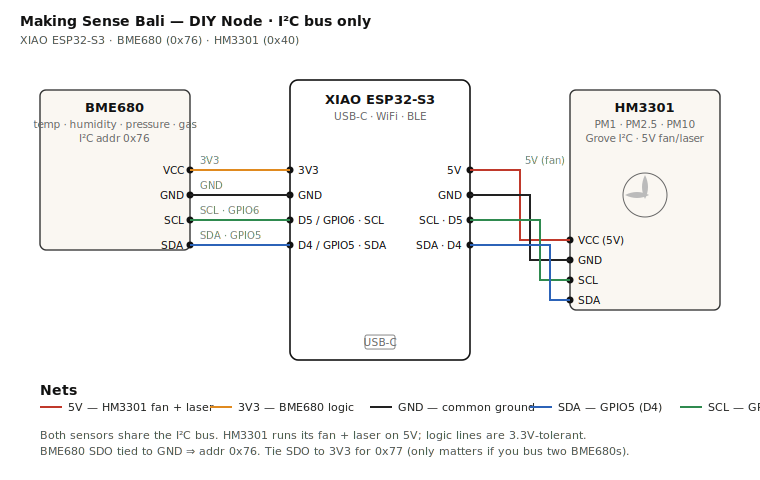

# DIY Node — the workshop sensor

A low-cost, fab-lab-buildable environmental node that publishes to the [Smart Citizen platform](https://smartcitizen.me/) over MQTT. Built around a **Seeed XIAO ESP32-S3** and a **BME680** (temperature, humidity, pressure, gas/VOC), optionally extended with a **Seeed Grove HM3301** for outdoor particulate matter. Two variants:

- **Basic** (XIAO + BME680) — ~USD 15–25. Indoor air quality, climate, mold-risk, VOC, mosquito-habitat monitoring.
- **Plus** (Basic + HM3301) — ~USD 35–60. Adds outdoor PM1 / PM2.5 / PM10 for burning, traffic, and construction dust.

Same firmware runs both — for Basic, you simply don't connect the HM3301 and leave its sensor IDs at 0 in the config. Assembly time in a workshop: ~2 hours for Basic, ~3 hours for Plus, from kit to live-on-the-dashboard.

This node is the **workshop entry point** to the Making Sense Bali campaign. It is not a replacement for an official [Smart Citizen Kit](https://smartcitizen.me/store) (~USD 150) — it's a spatial-density complement. Be honest about that distinction with workshop participants.

## What this is — and isn't

The DIY node exists to **multiply spatial density per campaign dollar**. The official SCK 2.1 at ~USD 150 is the trusted backbone — battle-tested firmware, calibrated multi-parameter sensing, plug-and-play. But for the same money as one SCK, the campaign can ship 3–4 DIY Plus nodes or 6–10 DIY Basics, deployed by participants in their own kos rooms, schools, warungs, and banjar compounds. That's the leverage: not "the SCK is too expensive" (it isn't, for the campaign team), but "we can't put an SCK in every kos in Denpasar — and the DIY tier can get close." A USD 20 Basic, built in a Fab Lab Bali workshop and deployed on the participant's wall, gets a non-technical resident producing public data on the same dashboard within an afternoon. That density is the point.

What you get:

What you get from either variant:

- **Temperature, humidity, and barometric pressure** with reasonable accuracy
- **Gas resistance (VOC indicator)** — picks up wood smoke, mosquito coil burn, cooking fuel emissions, vehicle exhaust, cleaning products. Published as raw kΩ; lower = more VOCs. This is a relative signal, not a calibrated IAQ index — see the deployment notes.
- **A Smart Citizen device record** that appears in the campaign dashboard alongside official SCKs and OpenAQ / Sensor.Community stations
- **A teaching artifact** — participants leave the workshop understanding I²C, ESP32 firmware, MQTT, and what "your data is public" means

What you additionally get with **Plus**:

- **PM1 / PM2.5 / PM10 readings** good enough to detect rice-burning events, traffic spikes, and construction dust
- **Combustion event triangulation** — only possible with both gas and PM in the same node (see use cases below)

What you do not get:

- The SCK's noise sensor, eCO₂, light, or ambient pressure-corrected PM
- The SCK's calibrated, drift-compensated readings (PM sensor drift in tropical humidity is real — see the deployment notes)
- A weatherproof IP65 enclosure (you'll print one in the workshop; the official SCK ships ready)
- Five years of firmware engineering by the Fab Lab Barcelona team

When the campaign reports DIY-node data, it is reported **as such** — with a different marker on the dashboard and a tooltip explaining the lower fidelity. Mixing DIY and official kits silently would be dishonest and would erode the campaign's credibility with the regional government conversations the campaign feeds.

## Two variants — Basic and Plus

### Basic — XIAO ESP32-S3 + BME680 (~USD 15–25)

| Qty | Part | Where | Notes |
|---|---|---|---|
| 1 | Seeed XIAO ESP32-S3 | Tokopedia (search "XIAO ESP32S3"), Shopee, Seeed Indonesia distributor | ~Rp 250–350k. The Sense variant works too but the camera is unused; standard XIAO is cheaper. |
| 1 | GY-BME680 breakout (6-pin) | Tokopedia search "BME680", generic Chinese clones work | ~Rp 150–300k. **Verify the IC marking reads BME680**, not BME280 or BMP280 — sellers sometimes mislabel. BME680 is the only one in that family with a gas/VOC sensor. |
| 1 | USB-C cable + 5V/1A power supply | Anywhere | Basic kit's power draw is modest; a phone charger works. |
| ~4 | 22 AWG jumper wires | Any electronics shop in Denpasar | Keep short — long jumpers add I²C noise. |
| 1 | Solderless breadboard (prototyping) + perfboard 5×7 cm (deployment) | Tokopedia "PCB matrix board" | Or skip straight to a printed PCB on Fab Lab Bali's mill for batch builds. |
| — | 3D-printed enclosure (PETG, not PLA) | Fab Lab Bali | PLA softens in Bali rooftop temperatures. PETG holds up. STL files: TODO. |

### Plus — Basic + HM3301 PM sensor (~USD 35–60)

Everything in Basic, plus:

| Qty | Part | Where | Notes |
|---|---|---|---|
| 1 | Seeed Grove HM3301 laser PM2.5 sensor v1.0 | Seeed direct, or Tokopedia "Grove HM3301" | ~Rp 450–600k. The kit's biggest cost driver. |
| (upgrade) | 5V/2A USB-C power supply | Anywhere | The HM3301's fan + laser draws ~80 mA peaks. The 1A supply that's fine for Basic browns out under PM-sensor load. |

### Choosing between them

**Basic** is enough if the deployment is indoor (kos rooms, traditional homes, school classrooms, market stalls), if the use case is mold / dengue habitat / heat stress / indoor VOC monitoring, or if the workshop budget is tight — more Basics = more spatial coverage.

**Plus** is necessary for outdoor air-quality monitoring (rooftops, banjar offices, coastal stations), for the rice-burning and traffic-pollution questions the campaign has flagged, or for the gas+PM triangulation that characterizes *what kind* of pollution event you're seeing.

For a 10-node workshop budget of ~USD 250, you can ship: 10 Basics, or 4 Plus + 5 Basics, or any mix. Strategy: pick deployment sites first based on Phase 1 matters-of-concern, then pick the variant per site.

**Sourcing note for Bali:** the HM3301 is the cost driver. Seeed's Indonesian distributor (Halo Robotics) carries it but markup is real. For a workshop ordering 5+ Plus kits, going direct from Seeed (Shenzhen → Denpasar) via Fab Lab Bali's shipping pipeline is usually cheaper than retail. Budget 3 weeks for shipping.

## What the data is good for — Bali use cases

The kit's value isn't the readings — it's the readings interpreted by people who live somewhere and act on what they see. Here's what the data looks like for the issues this campaign actually tracks.

### Dengue mosquito habitat (Basic)

Aedes aegypti, Bali's primary dengue vector, breeds optimally at 25–30°C and >70% relative humidity. Both conditions are the default in lowland Bali through most of the year, which is why dengue is endemic, not seasonal in the way it is in temperate places.

What the Basic kit gives you isn't a "dengue alarm" — it's a hyperlocal record of how many hours a specific banjar, school, or kos compound spent in optimal mosquito-breeding conditions. Overlaid with Dinas Kesehatan case data, the question shifts from "how many dengue cases this month" to "which microclimates concentrate risk, and which interventions (fogging schedules, water-container clearing) actually broke the cycle." Most regional dengue surveillance lags case-reporting by 2–4 weeks; the environmental signal is real-time.

### Mold and respiratory health (Basic)

Mold grows when RH sits above ~60% with temperatures of 20–30°C — Bali's default indoor conditions through the October–April wet season in most non-AC dwellings. Mold spores are a documented asthma and allergic-rhinitis trigger, particularly for children.

The Basic kit lets a resident see, with their own data, that their bedroom spent 14 hours yesterday in mold-favourable conditions. That's actionable: open windows in the afternoon when humidity drops, run a small dehumidifier, push the landlord on ventilation. "My doctor said I have asthma" is hard to act on. "Your bedroom has been at 78% RH for the last week" is easier.

### Heat stress and outdoor work (Basic)

Heat stress isn't temperature alone — it's wet-bulb temperature, a function of T and RH together. Bali outdoor workers (banjar maintenance, construction, agriculture, ceremony cooks) routinely hit dangerous combinations in dry-season afternoons. Wet-bulb above 30°C significantly impairs physical work; above 33°C is dangerous within hours.

The Basic kit can compute a heat index for any deployment site. Mounted near a construction site, market, or banjar gathering point, it gives workers and their employers a shared signal: "this site is at heat-stress conditions today, schedule heavy work earlier or break for shade."

### Indoor VOC and combustion exposure (Basic)

The BME680's gas sensor responds to volatile organic compounds — mosquito coil smoke, kerosene cooking emissions, cleaning chemicals, paint solvents, cigarette smoke, the capsaicin volatilisation from sambal frying. Documented research (Liu et al., 2003) found that a single overnight mosquito coil releases PM2.5 mass comparable to burning ~75–100 cigarettes, alongside substantial formaldehyde.

The Basic kit publishes raw gas resistance in kΩ; lower = more VOCs. A node in a kitchen or bedroom shows patterns — "your gas resistance drops every night between 9 PM and 5 AM because of the mosquito coil." That's a conversation about alternatives (mosquito nets, electric vaporisers, ventilation), not a vague worry about "indoor air".

### Outdoor PM — rice burning, traffic, construction (Plus only)

Bali's worst outdoor air quality periods are tied to rice-stubble burning, typically July–October when post-harvest fields are burned across Tabanan, Gianyar, and Klungkung. PM2.5 spikes of 200–400 µg/m³ downwind of burning fields are not rare. The Basic kit's gas sensor sees these as a VOC signal, but the particulate concentration — the part with documented cardiopulmonary health impact — needs the HM3301.

The Plus kit also captures traffic corridors (Canggu, Seminyak, Kuta intersections during rush), construction dust (Ubud villa boom, southwest beachfront development), and coastal diesel exhaust (tourist boat traffic at Sanur, Padangbai, Amed). For any deployment where outdoor PM is the question, Plus is required.

### Combustion event triangulation (Plus)

This is the analytical capability you only get by running gas and PM in the same node. Air-quality events leave different signatures:

- **Gas resistance drops AND PM spikes** = combustion. Burning rubbish, wood smoke, vehicle exhaust. Both released together.
- **PM spikes, gas stable** = dust. Construction, traffic-kicked road dust, ash without active burning. No VOCs.
- **Gas resistance drops, PM stable** = vapour. Solvents, paint, fuel, cleaning products. VOCs without combustion particulates.

This signature analysis lets the campaign say more than "the air is bad" — it lets it say *what kind* of bad, which has different policy implications. A "construction dust" finding pushes one conversation (site water-spraying, work-hour limits); a "burning event" finding pushes another (waste collection schedules, banjar-level burning rules); a "vapour" finding pushes a third (workplace ventilation, household chemical storage).

This triangulation is a Plus-kit-only capability and a meaningful research output beyond what the official SCK measures — the SCK has eCO₂ via CCS811 but not raw gas resistance.

## Where this fits — the campaign's sensor tiers

The DIY node isn't a standalone instrument; it's one tier of a multi-fidelity sensing network. Making Sense Bali is built (or aims to be built) at four tiers, each lower tier referenced against the one above. That reference chain is what separates "the campaign published a dashboard" from "the campaign published data the regional government cited in a policy decision." Without it, every reading carries an asterisk; with it, the campaign can publish confidence intervals, derive event counts, and stand behind seasonal aggregates.

| Tier | Hardware | Cost | Role | Typical count |
|---|---|---|---|---|
| **0 — Reference** | BAM-1020, Met One E-BAM, Aeroqual AQM 65, or hosted BMKG / Udayana station | USD 5,000–25,000+ | Ground truth. Regulatory- or near-regulatory-grade. Calibration anchor for everything below. | 1 per bioregion, hosted by institutional partner |
| **1 — Smart Citizen Kit 2.1** | Official SCK from [smartcitizen.me](https://smartcitizen.me/store) | ~USD 150 | Trusted multi-parameter backbone (PM, eCO₂, noise, climate, light). Battle-tested firmware. | 3–10, deployed by the campaign team |
| **2 — DIY Plus** | This repo, with HM3301 | ~USD 35–60 | Spatial density at outdoor sites. Same PM + climate metrics as SCK but lower fidelity. | 10–50, deployed by participants after workshops |
| **3 — DIY Basic** | This repo, without HM3301 | ~USD 15–25 | Maximum reach. Indoor AQ, climate, VOC, mold / dengue / heat / indoor combustion use cases. | Many — schools, kos, banjars, individual homes |

### The calibration chain

Each tier is calibrated against the one above it. **Corrections live in the dashboard processing layer (`data.js`, the Cloudflare Worker), not in the firmware** — firmware corrections are unauditable, dashboard corrections are versioned and reproducible.

**Tier 0 → Tier 1.** A BAM-1020 outright is a USD 25k purchase plus annual maintenance, which the campaign won't carry on its own. The pragmatic path for Bali is a partnership with **BMKG (Stasiun Klimatologi Bali, Sanglah)** for co-location at their existing reference climate stations, or with **Udayana University's Faculty of Engineering or School of Public Health** to host a mid-tier instrument like Aeroqual AQM 65 (~USD 8–15k, robust in tropical humidity, lower maintenance than a BAM). Both routes are conversations, not procurements.

**Tier 1 → Tier 2.** Official SCKs are co-located with the Tier 0 reference for a week each season (dry, wet, transition). The dashboard derives a correction factor per SCK per season. After the calibration sprint, SCKs deploy across the bioregion as the trusted backbone.

**Tier 2 → Tier 1.** DIY Plus nodes are co-located with a calibrated SCK for ~5 days during their first deployment. A correction factor is derived for the Plus node's HM3301 against the local SCK. From then on the Plus data is "SCK-corrected" — usable for trend analysis and event detection, flagged in the dashboard as derivative, not primary.

**Tier 3 → Tier 1.** DIY Basic nodes don't carry PM, so PM calibration doesn't apply. Temperature and humidity get a sanity-check against the nearest SCK; gas resistance is a relative signal that doesn't need absolute calibration (lower = more VOCs is true regardless of the reference).

### What a realistic network looks like

For a bioregion the size of southern Bali:

- 0–1 Tier 0 instruments (depending on partnerships)
- 5–8 Tier 1 SCKs at strategic outdoor sites (banjar offices, partner Fab Lab, rooftop nodes in different microclimates)
- 20–40 Tier 2 DIY Plus at outdoor community sites (schools, warungs near roads, beachfront)
- 50+ Tier 3 DIY Basic indoors (kos rooms, classrooms, individual homes)

That's ~75–100 nodes for roughly the cost of 10–15 SCKs alone. The data still leans on Tier 0/1 for credibility, but the spatial resolution is what makes the dashboard useful — you can see *which neighborhood* burns rubbish on Wednesday evenings, not just that "south Bali had elevated PM."

### First moves before the network gets bigger

Three concrete actions, in the order they matter:

1. **Open the BMKG conversation now**, before the campaign needs the reference data. BMKG Stasiun Klimatologi at Sanglah operates reference-grade climate instruments. The ask is small — can the campaign co-locate one or two SCKs at the BMKG site for one week each season? That single co-location chain unlocks credibility for the entire downstream network.
2. **Designate one SCK as the campaign's "reference within the network"** even before Tier 0 is in place. Pick the one most carefully maintained and most rarely moved. Its readings become the bridge until a proper reference exists.
3. **Run the first DIY workshop only after step 2** so the Plus nodes have something to be co-located with. A DIY Plus deployed without any reference path is a node the campaign can't defend if asked.

The calibration factors themselves — when they were taken, what they are, how they're applied in the dashboard — belong in `docs/calibration.md` (to be written; this is the next-actionable doc after this README).

## Wiring

The schematic below shows the **Plus** wiring. For **Basic**, skip the right half — the HM3301 rows in the table — and only wire the BME680.

Both sensors live on the same I²C bus when both are present. Four wires from the XIAO go to both sensors in parallel; power differs (5V for HM3301's fan, 3.3V for BME680 logic).

| XIAO pin | XIAO label | Goes to | Net |
|---|---|---|---|
| 5V | `5V` | HM3301 VCC | 5V power (fan + laser) |
| 3.3V | `3V3` | BME680 VCC | 3.3V power (logic) |
| GND | `GND` | HM3301 GND **and** BME680 GND | Common ground |
| GPIO5 | `D4` | HM3301 SDA **and** BME680 SDA | I²C data (shared) |
| GPIO6 | `D5` | HM3301 SCL **and** BME680 SCL | I²C clock (shared) |

The BME680 breakout exposes SDO and CS pins. Leave SDO floating (or tie to GND) for I²C address `0x76`. Leave CS pulled high (most breakouts handle this internally). Ignore the SPI pins entirely.

**I²C addresses on this bus:**

- BME680 → `0x76` (or `0x77` if you tie SDO to 3V3 — only relevant if you bus two BMEs)
- HM3301 → `0x40`

If you have `i2cdetect` running on a Linux laptop or want a sketch, scan the bus first to confirm both addresses show up. If only one appears, check power, then check the pull-up resistors (the XIAO has internal weak pull-ups but the HM3301's Grove cable assumes external pull-ups exist somewhere on the bus — usually the BME680 breakout provides them).

## Smart Citizen platform — register the device

Before flashing, set up the device on Smart Citizen:

1. Sign in at [smartcitizen.me](https://smartcitizen.me/).
2. Add a new device. Pick **"Other devices"** → custom hardware. Give it a name like `Bali DIY Node — [location]`.
3. Add the sensors you'll publish. For this kit:

   **Both variants:**
   - **Temperature** (°C) — BME680
   - **Humidity** (%) — BME680
   - **Pressure** (hPa) — BME680 *(optional, leave the firmware ID as 0 to skip)*
   - **Gas resistance** (kΩ) — BME680 VOC indicator

   **Plus variant only — add these too:**
   - **PM1** (µg/m³) — HM3301
   - **PM2.5** (µg/m³) — HM3301
   - **PM10** (µg/m³) — HM3301

   For a Basic kit, just leave the PM sensor IDs at 0 in the firmware config; the publish step skips any sensor with ID 0.
4. Set the location to the deployment coordinates (not your laptop's IP geolocation — the actual rooftop).
5. From the device's dashboard page, copy:
   - The **device token** (used for MQTT auth)
   - Each **sensor's numeric ID** (you'll paste these into the firmware)

The device token is what authenticates the node against the platform. It can be revoked from the dashboard if a kit goes missing — treat it like a password.

## Firmware

Two sketches in this repo. **Flash the test sketch first.**

### Test sketch — bring-up tool, no platform needed

[`firmware/diy_node_test/diy_node_test.ino`](firmware/diy_node_test/diy_node_test.ino) is a verification-only sketch. It scans the I²C bus, probes both sensors, and prints readings to the Serial Monitor every 5 seconds. **No WiFi, no MQTT, no Smart Citizen account required.** This is what a workshop participant flashes immediately after soldering — if sensible numbers appear in Serial Monitor, the hardware is working and they can proceed to the full firmware with confidence. If not, the test sketch's I²C scan and per-sensor probe output usually points straight at the wiring or power problem.

Works for both Basic (BME680 alone) and Plus (BME680 + HM3301) kits — the test sketch detects which sensors are present and prints only what it finds.

### Production sketch — publishes to Smart Citizen

**Same sketch runs both Basic and Plus.** For Basic, the HM3301 init at boot returns "NOT FOUND", the firmware logs it once, and skips PM publishing for every cycle. No code changes — just don't connect the HM3301 and leave its three sensor IDs at 0 in the config block.

The production firmware sketch is at [`firmware/diy_node/diy_node.ino`](firmware/diy_node/diy_node.ino). It:

- Brings up I²C and probes both sensors at boot
- Connects to WiFi and syncs the clock via NTP (the platform requires real `recorded_at` timestamps)
- Reads temp, humidity, PM1, PM2.5, PM10 every 60 seconds
- Publishes one MQTT message per cycle to `device/sck/{DEVICE_TOKEN}/readings` on `mqtt.smartcitizen.me:8883` (TLS)
- Payload shape matches the platform's documented format (`data` → `recorded_at` + `sensors[]`)

Required Arduino libraries (install via Library Manager):

- `Adafruit BME680 Library` (depends on `Adafruit Unified Sensor`) — note: **not** the BME280 library
- `PubSubClient` by Nick O'Leary (MQTT) — only needed by the production sketch
- `ArduinoJson` v7.x — only needed by the production sketch

The HM3301 is read directly over I²C — no external library needed. See note below on why.

Board: install the **esp32 by Espressif Systems** package in Arduino IDE board manager, then select **XIAO_ESP32S3**.

**Why no Seeed_HM330X library?** Seeed's HM3301 Arduino driver is written against the old AVR Arduino toolchain and uses non-standard `u8` / `u16` / `u32` type aliases without defining them. The modern arduino-esp32 core doesn't provide those typedefs, so the library's own `.cpp` file fails to compile with `error: 'u32' has not been declared`. A typedef shim in the sketch can't fix this — the library's `.cpp` is a separate translation unit.

Rather than patch a vendor library on every developer's machine, both sketches in this repo talk to the HM3301 **directly over I²C**. It's a one-time `Wire.write(0x88)` at boot to select I²C mode, then `Wire.requestFrom(0x40, 29)` for each 29-byte data frame. The frame layout (per the HM-3300/3600 datasheet) is documented inline above the `readHM3301` function — atmospheric PM1/PM2.5/PM10 are at buf[10..15], plus a checksum at buf[28] that we verify before trusting the read.

Total cost: ~15 lines of code, zero external dependency for this sensor.

Edit the configuration block at the top of `diy_node.ino` — WiFi credentials, the device token, and the five sensor IDs from the SC dashboard. Flash, open serial monitor at 115200 baud, watch the connection sequence. Within a couple of minutes the device should appear "online" on smartcitizen.me with readings flowing.

If readings don't appear: check that the sensor IDs in the firmware match exactly what's on the SC device page (they're numeric and per-device), and that the device hasn't been marked "private" — public is the default.

## Prototyping path

Do not skip steps. Each one isolates a different class of bug.

**Stage 1 — Breadboard, USB-powered, in your workshop. Test sketch first, then production.** Wire it up with jumpers. **Flash `diy_node_test.ino` first** and confirm sensible readings in Serial Monitor — this proves the hardware works in isolation, no cloud setup required. Only after that, switch to `diy_node.ino`, fill in WiFi credentials and Smart Citizen device token / sensor IDs, and confirm the device appears on smartcitizen.me. Splitting the bring-up this way isolates hardware bugs from platform bugs — if both work in sequence, you're solid.

**Stage 2 — Perfboard, USB-powered, indoor.** Solder onto a 5×7 cm matrix board. Use **female headers** for the XIAO and the BME680 — they're the parts most likely to die from a wiring mistake or surge, and you want to swap without desoldering. The HM3301 stays connected via its Grove cable. Run it for 48 hours indoors next to a known reference (a phone's air quality app pointed at a window will do for a sanity check). Confirm readings are stable, the device doesn't reset, and MQTT reconnects after WiFi drops.

**Stage 3 — Enclosure, deployed.** 3D-print a PETG enclosure with vents for the PM sensor inlet and the BME680's pressure port. The enclosure is its own design problem — see the Bali deployment notes below. Mount it under shade, never in direct sun. Power via a weatherproof USB supply or a 5V solar panel + buck converter (the latter is a separate project; start with wall power).

**Stage 4 — Printed PCB (optional, for batch builds).** Once a design has run reliably in stage 3 for a few months, layout a custom carrier board in KiCad and mill it on Fab Lab Bali's PCB printer. This is the "we're committing to deploying 20 of these" stage, not the first build.

## Bali deployment notes

The reason the campaign exists is the data, not the firmware. Take this part seriously.

**Humidity.** Bali is 80%+ relative humidity for most of the year. Uncoated boards corrode in 6–12 months. After stage 2, **coat the soldered side of the perfboard with silicone conformal coating** (MG Chemicals 422B or similar — it's available in Singapore, ships to Bali). Mask the sensor openings and the USB-C connector before spraying. The BME680's humidity port and the HM3301's air inlet must stay uncovered. The conformal coating step alone roughly doubles deployment lifetime.

**PM sensor drift.** Plantower-derived sensors (the HM3301 is in this family) drift up over time in high humidity — readings creep 30–50% high after 12–18 months in Bali conditions. **The firmware does not compensate for this.** For a workshop kit, that's an acceptable tradeoff. For data the campaign uses in policy conversations, **co-locate the DIY node with an official SCK or a known reference for at least a week**, derive a correction factor, and apply it in the dashboard's processing layer (not in the firmware — corrections belong in the data pipeline). This is the same pattern Sensor.Community uses for their low-cost network.

**Gas sensor burn-in.** The BME680's metal-oxide gas sensor needs ~24 hours of continuous operation before its readings stabilise — the heater needs time to burn off surface contaminants from the manufacturing process. Don't trust the first day of gas resistance data. After that, expect slow upward drift over months as the sensor element ages — the **trend** matters more than the absolute value. For Bali, the most useful gas signal is correlation: a gas-resistance dip co-occurring with a PM2.5 spike points at combustion (burning rubbish, wood smoke); a dip without PM points at solvents or fuel vapor.

**Enclosure.** Sun + Bali rains will destroy a poorly enclosed node in weeks. The HM3301's air inlet must face down or sideways (never up — rain) and must be protected from direct insect entry (a fine stainless mesh over the inlet helps, but check for clog buildup monthly). The BME680's humidity sensor needs airflow but not water — a Stevenson-screen-like louvered approach is the right pattern. Don't deploy on a tin roof in direct sun without thermal isolation; the BME680 will read 15°C high.

**WiFi.** Bali's WiFi reliability ranges from "fine" to "the cable to Singapore is out today." The firmware must reconnect on WiFi loss and keep the device running locally even when offline. Current firmware drops readings when offline — adding a small buffer of unsent readings is a known enhancement (TODO).

**Power.** Most deployments will be wall-powered via a 5V/2A supply. A power loss is the most common cause of "the node went silent" — the participant unplugged it to charge their phone. Workshop framing helps: this is part of the data, label the supply clearly with `Smart Citizen — do not unplug`.

## Workshop format (suggested)

A half-day workshop at Fab Lab Bali, 6–10 participants, two builders per kit (one solders, one flashes; rotate).

- **Hour 1** — campaign framing (why are we measuring? what's a banjar's stake in this?), tour of the dashboard, look at existing readings together
- **Hour 2** — kit assembly (solder onto perfboard, wire it up, no firmware yet)
- **Hour 3** — firmware flash, WiFi config, device registration on smartcitizen.me, first reading
- **Hour 4** — enclosure decisions (where will this live? what does it face? who plugs it back in if it falls off the wall?)

What the participant takes home: a working node, a printed enclosure, a labeled USB supply, and a printed one-pager with the device's URL on smartcitizen.me and the campaign's WhatsApp number to call if it stops working.

What the campaign takes from the workshop: a new dot on the dashboard, the participant's permission to publish, and a named accountable person at the deployment location.

## License

Same as the parent campaign repo: code MIT, docs CC-BY-SA 4.0. Fork it for Smart Citizen [your city] and tell us what changed.
