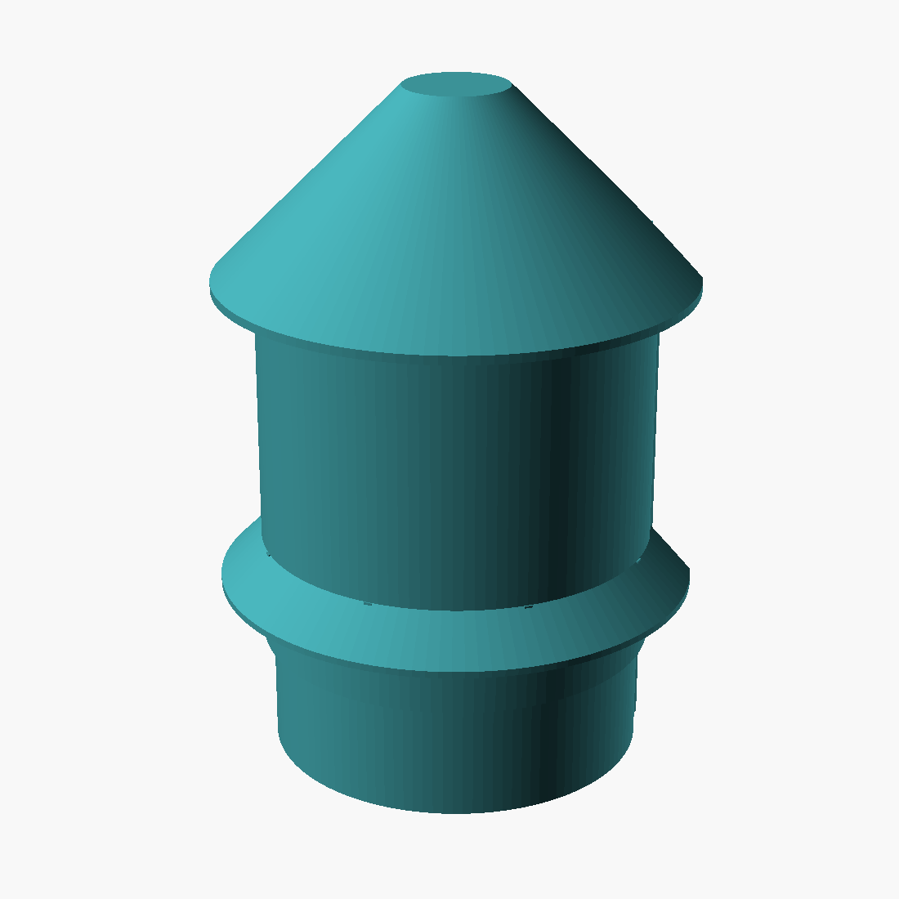

# DIY Node enclosure — the lantern

This folder closes the "STL files: TODO" in the parent README. One parametric OpenSCAD model ([`enclosure.scad`](enclosure.scad)) generates both variants — **Basic** (XIAO ESP32-S3 + BME680 on a 5×7 perfboard) and **Plus** (adds the HM3301 PM bay). Pre-rendered STLs in [`stl/`](stl/), previews in [`img/`](img/).

A box with louvers is laser-cutter thinking. This is printer thinking: a D-section shell with two continuous skirt vents and a 45° cone spire — compound curves a flat-material process can't make, printed in **two parts, support-free, snap-fit, no glue, no machine screws**. The walls are thin (1.6 mm shell, 1.3 mm skirts) because curvature does the stiffening, not material. Total plastic: **~90 g for Plus, ~74 g for Basic** — about half the box prototype this replaces.

| | Basic | Plus |
|---|---|---|
| Body Ø | 75 mm | 75 mm |
| Max Ø (skirts/brim) | 91 mm | 91 mm |
| Height | 107 mm | 130 mm |
| Printed parts | core + hood | core + hood |
| PETG | ~74 g | ~90 g |



## The two parts

**Core** — floor, PM cradle, and mounting spine in one piece. The flat back hangs on four keyhole screws; the cup at the bottom holds the HM3301 face-down over two mesh-screened windows; vertical rails take the perfboard; 45° chamfers under the rail blocks are what make the standing print support-free. Prints as exported, floor on the bed.

**Hood** — the lantern. Cone spire, two body bands, a flared skirt over each vent gap, all one revolved piece. Prints as exported, **inverted** — spire cap on the bed — which turns every down-and-out rain surface into a rising 45° surface the printer lays down happily. Slides over the core and clicks onto the cup flange with two printed nubs. No fasteners.

`part="plate"` exports both parts print-oriented side by side: one STL, one print job, a complete enclosure (needs ~200 × 100 mm of bed and 135 mm of Z; on smaller beds print the parts separately).

## Why it looks like this

**Rain gets geometry, not gaskets.** The spire sheds everything; its brim overhangs the exhaust vent. Each vent is a continuous gap shaded by a conical skirt whose tip drops past the gap's lower edge — there is no horizontal line of sight into the body anywhere. The PM sensor breathes through the floor: its inlet and outlet face the ground over separate mesh windows with an 8 mm isolation band between them (the HM3301 datasheet's required airflow separation, built in). The USB cable leaves through the floor with a drip loop.

**Airflow is the chimney the shape makes.** Warm air from the XIAO rises out the top vent under the brim; fresh air enters under the lower skirt. Continuous 360°-minus-chord gaps move more air than any pattern of slots, with less plastic. Build rule on the perfboard: **BME680 at the bottom edge** (intake level), **XIAO at the top** (exhaust level) — the heat goes up and away from the sensor that measures temperature.

**Readings stay honest.** White PETG (solar gain), skirts double as shade rings, the sensor never sees the sky or the wall directly. None of this survives a bad site — siting rules below still decide data quality.

## Printing

PETG, always — PLA softens on Bali rooftops. White strongly preferred. 0.2 mm layers, 4 perimeters at 0.4 nozzle, no supports, part cooling on.

| Part | Orientation | Notes |
|---|---|---|
| core | as exported — standing on its floor | 5 mm brim; the spine is a tall flag and wants the help |
| hood | as exported — spire cap on the bed | 10 mm brim — first layer is only the Ø20 cap disc. Skirts print as rising 45° cones; nothing overhangs |

Roughly 3–4 h per part at 0.2 mm. First print on a new machine: stop the core after ~25 mm and test-fit your HM3301 in the fence and a perfboard offcut in the rails; clearances assume a calibrated printer (`drop_fit` is the knob if it fights you).

Regenerate after editing parameters:

```sh
openscad -o stl/diy-node-plus-hood.stl -D 'variant="plus"' -D 'part="hood"' enclosure.scad
```

parts: `core` / `hood` / `plate` / `assembly` · variants: `basic` / `plus` · set `use_screws=true` if you want M3 backup screws through the hood into the rail blocks (pilots are already there).

## What else you need

| Qty | Item | Notes |
|---|---|---|
| 1 | stainless woven mesh ~35 × 33 mm, 0.5–1 mm aperture | Plus only; any Denpasar hardware stall |
| 4 | wall screws + plugs, pan head ≤ Ø8 | drive to ~4 mm standoff; the keyholes hang on them |
| 2 | zip ties | strain relief at the chassis post |
| opt | 2 × M3 × 10 self-tapping | only if you set `use_screws=true` |

## Assembly

1. Slide the soldered perfboard down the spine rails — component side out, **BME680 edge down, XIAO edge up**, USB-C toward the right gap.
2. Plus: mesh sheet into the floor pocket, HM3301 face-down into the fence until both fingers click over the can. Grove pigtail up.
3. Cable down the right gap, out the floor arch. Zip-tie at the post, drip loop outside.
4. Hood down over everything until the nubs click on the cup flange.
5. Four wall screws (top pair 38 mm apart), hang, tug to seat.

Wiring, firmware, registration: parent [README](../README.md). Nothing here changes the electronics.

## Siting rules (the enclosure can't save a bad site)

Under eaves on a shaded wall — that's the design assumption. More than 20 cm off the ground (HM3301 datasheet: ground-level floc wraps the fan), 1.5–2 m is the sweet spot. Not over bare tin roofing, not where afternoon sun bakes the wall — if it does, add 10 mm spacers behind the keyholes. Check the floor mesh monthly; a clogged mesh reads as "the air got cleaner." Gas-sensor burn-in and SCK co-location per the parent README; the enclosure changes neither.

## Known limits, honestly

A passive-vented shell is not IP65 — horizontal monsoon gusts will eventually push some moisture in, and the conformal-coating step in the parent README is what actually protects the board. Fully exposed sites (rooftop masts, no eaves) need a pole mount this v2 doesn't have. The PM cradle is dimensioned for the HM3301 (40 × 38 × 15); the SEN54 refresh under evaluation gets its own cradle revision when validated — a `fence_*`/`win_*` parameter change in the core, the hood doesn't care. The snap nubs are tuned for PETG's flex; if you print something stiffer, scale them down or use the screw option.

License: MIT, same as the parent repo. Fork it for Making Sense [your place] and tell us what changed.
