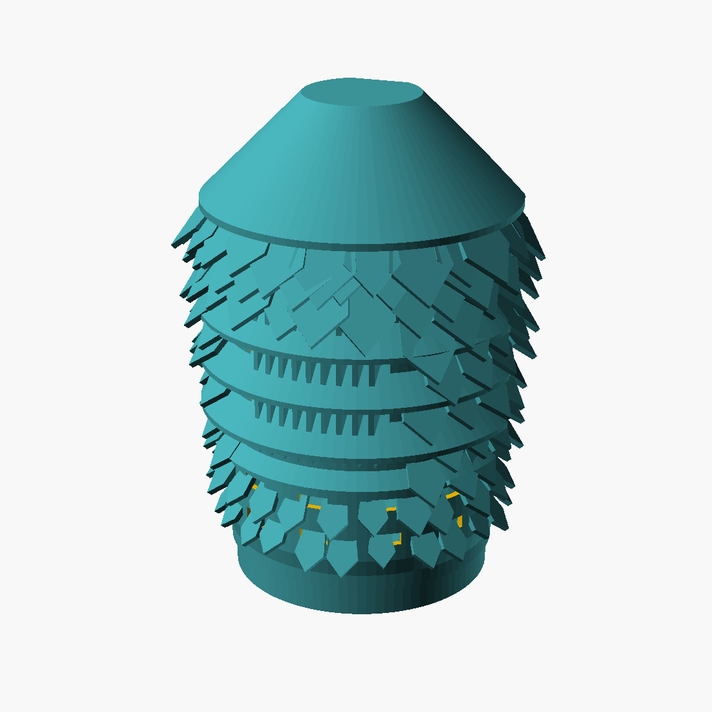

**English** · [Bahasa Indonesia](README.id.md) · [Español](README.es.md)

# DIY Node enclosure v5 — the pine cone

One parametric OpenSCAD model ([`enclosure.scad`](enclosure.scad)) generates both variants — **Basic** (XIAO ESP32-S3 + BME680 on a 4×6 cm perfboard) and **Plus** (adds the Grove HM3301 PM module, vertical). STLs in [`stl/`](stl/), previews in [`img/`](img/), the four earlier designs in [`archive/`](archive/) with a review-before-printing disclaimer.

A pine cone is already an outdoor enclosure: overlapping scales that shed rain outward and open to let air through. v5 borrows the whole idea with exactly **ten big leaves** — four low over the intake slots, a pair flanking the grille (three mid-arc on Basic), four high fusing into the cap over the exhaust. Rain protection and ventilation are the same geometry: every breathing slot hides in a leaf's rain shadow. Each leaf prints support-free — inverted, they become rising ~40° fins. Seeded jitter on size, angle, and azimuth keeps it organic without sacrificing reproducibility: same `scale_seed`, same tree; the `leaves_plus` / `leaves_basic` tables in the source are the layout if you want to art-direct your own.

| | Basic | Plus |
|---|---|---|
| Body Ø (core wall) | 66 mm | 66 mm |
| Scale envelope | ~Ø90 | ~Ø90 |
| Height | 99 mm | 119 mm |
| Printed parts | core + hood | core + hood |



## The skin is the function

**Rain:** each scale shades the wall band below it at better than 45°; the cap covers the top rows; a 45° sill sheds the grille's bottom lip. There is no horizontal sight line to any opening. **Air:** small slots hide in the rain shadow under scale rows — intake low at the BME680's level, exhaust high under the cap — so the chimney works without any visible vent. **The PM grille** sits in a scale-free patch: vertical gecko bars, three scale-line shade rings, and the module's metal can face 3–4 mm behind with a fine mesh patch taped over its ports. The HM3301 datasheet permits sideways ports; burn-in and SCK co-location (parent README) remain the real calibration.

## No labels — footprints

Components locate by shape, not text, and the shapes are real. On the spine: the **XIAO ESP32-S3 footprint** — true 21 × 17.8 outline, its two 7-pin header rows at 2.54 mm pitch (they align with the perfboard grid when sighted through the holes), and the USB-C oval on the cable side; the **BME680 footprint** — outline, 6-pin header row, sensor-lid square; a **battery pictogram** at the cell's height. On the floor: a **USB pictogram** at the cable arch, the **LiPo lip/frame** that physically locates the cell, and two **registration pegs** at the Grove carrier's Eagle-verified Ø3.2 hole positions — when the module reaches the bottom of its rails the pegs click in, which *is* the seated-and-oriented check.

## LiPo, eyes open

Optional 803040 (~1000 mAh) wired to the XIAO BAT pads before assembly. Basic: stands in the printed floor frame, zip-tied. Plus: foam-taped to the carrier's back inside its printed outline; the floor lip stops it sliding. A pouch cell in Bali heat ages fast — quality protected cells only, check at mesh-cleaning time, USB stays the permanent supply. `with_battery=false` removes the provisions.

## Printing

White PETG (or wood-fill PLA+ for indoor demo cones — outdoors stays PETG), 0.2 mm layers, 4 perimeters, no supports, part cooling on.

| Part | Orientation | Notes |
|---|---|---|
| core | as exported — standing | 5 mm brim |
| hood | as exported — cap down | **10 mm brim**; scales print as rising fins, slow outer perimeters help the tips |

The hood runs ~4–5 h — ten leaves cost much less than the dense-scale experiment they replaced. First print: pause the core at ~20 mm, test-fit a perfboard offcut and the Grove carrier; `fit` / `drop` are the knobs; `can_cx` moves the grille; `scale_seed` rerolls the cone.

```sh
openscad -o stl/diy-node-plus-hood.stl -D 'variant="plus"' -D 'part="hood"' enclosure.scad
```

parts: `core` / `hood` / `plate` / `assembly` · variants: `basic` / `plus` · flags: `with_battery`, `scale_seed`

## What else you need

| Qty | Item | Notes |
|---|---|---|
| 1 | fine stainless mesh patch ~40 × 40 mm | Plus: taped to the can face over the ports |
| 2 | M3 × 8 self-tapping screws | the joint |
| 4 | wall screws + plugs, pan head ≤ Ø8 | keyholes, ~4 mm standoff |
| 2–3 | zip ties | USB strain relief; Basic battery frame |
| opt | 803040 LiPo + foam tape | see above |

## Assembly

1. Hang the core on 4 pre-driven wall screws — keyholes sit behind the boards (top pair 30 mm apart).
2. Solder the module's four wires to its carrier test pads; battery (if any) to the XIAO BAT pads; place components against their spine footprints before soldering the perfboard.
3. Perfboard down the rear grooves — XIAO at its outline (top), BME680 at its outline (bottom), USB-C toward the right.
4. Plus: module down the front grooves until the floor pegs click into its mounting holes (that *is* the orientation check). Mesh patch already on the can face.
5. USB cable out the floor arch — follow the pictogram — zip-tied at the post, drip loop outside.
6. Hood down over the spine until it seats on the cup shoulder; two M3 screws through the collar.

## Siting rules

Under eaves on a shaded wall, more than 20 cm off the ground, 1.5–2 m sweet spot, never over bare tin roofing. Point the grille away from the prevailing monsoon wind. Check the mesh patch and weeps monthly; brush leaf litter off the scales while you're there — they collect it exactly the way real cones do.

## Known limits, honestly

Not IP65 — conformal coating (parent README) protects the electronics, the scales protect the airflow. The scaled hood costs more plastic (~55 g vs v4's 40) and print time; that's the price of the skin, and `archive/v4-column/` remains the fast plain build. Scale tips are the part you'll snag carrying it — they're 1.35 mm thick and survive handling, but don't stack the hoods in a box. SEN54 refresh gets its own revision when validated.

License: MIT, parent repo. Seeed board reference: [`ref_hm3301_board.pdf`](ref_hm3301_board.pdf) (CC-BY-SA). Fork it for Making Sense [your place] — and reroll `scale_seed` so your forest has different trees.
