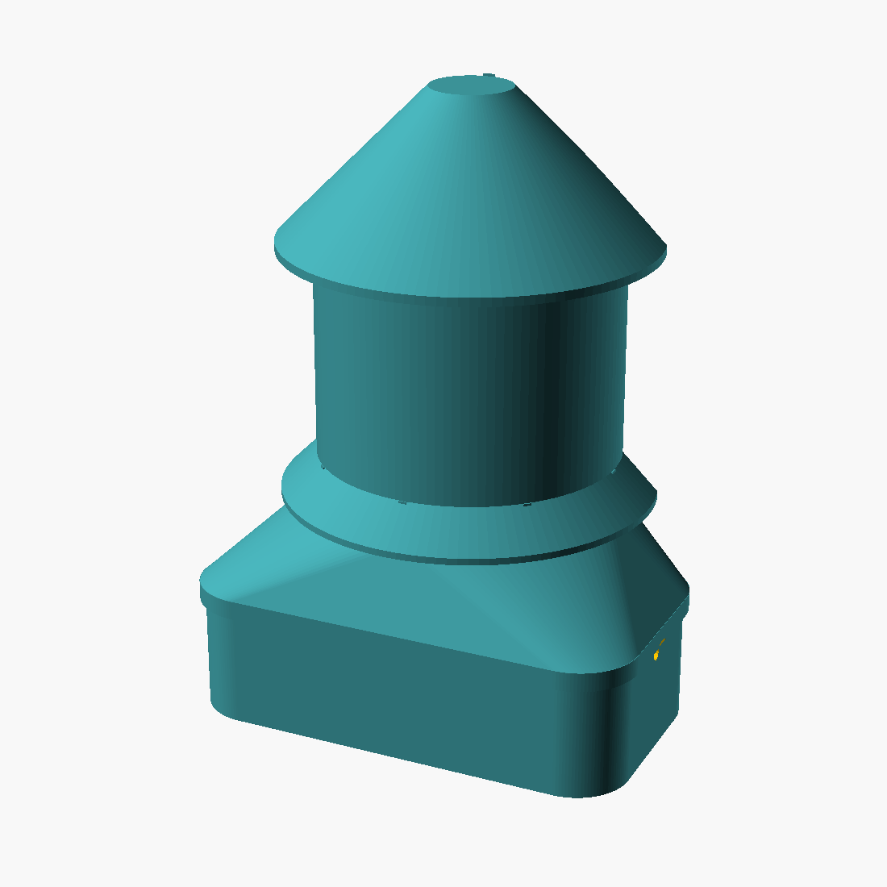

# DIY Node enclosure v3 — the gourd

One parametric OpenSCAD model ([`enclosure.scad`](enclosure.scad)) generates both variants — **Basic** (XIAO ESP32-S3 + BME680 on a 4×6 cm perfboard) and **Plus** (adds the Grove HM3301 PM module). Pre-rendered STLs in [`stl/`](stl/), previews in [`img/`](img/).

v3 exists because v2 met a printer and lost. Three lessons are baked in. First, the PM part is not the 40×38 mm metal can — it's the can on an **80×40 mm Grove carrier PCB** (dimensions pulled from Seeed's Eagle board file: Ø3.2 mounting holes at ±36/±16, Grove socket on the left end, pigtail header on the right). The bay now fits the real module. Second, the hood↔core joint now actually closes: a hard shoulder stop, 0.5 mm radial clearance, chamfered lead-ins, and two M3 screws into bosses — not press-your-luck snap nubs. Third, the whole thing shrank: a XIAO and a BME680 were rattling around a 5×7 perfboard, so the spec drops to 4×6 cm and the body drops from Ø75 to Ø59. Only the foot stays wide, because the module is 80 mm long and geometry doesn't negotiate.

| | Basic | Plus |
|---|---|---|
| Body Ø | 59 mm | 59 mm |
| Brim Ø | 73 mm | 73 mm |
| Foot | — | 88 × 48 mm |
| Height | 97 mm | 121 mm |
| Printed parts | core + hood | core + hood |



## The two parts

**Core** — floor, module cradle, and mounting spine in one standing print. The Grove module mounts **inverted**: can face-down over two mesh-screened floor windows, located by four pegs that match the carrier's Ø3.2 holes, held by two fingers over the carrier edges. Solder your four wires to the carrier's test pads **before** dropping it in — the Grove socket faces down once mounted, and there's no room for a plug. The spine takes the perfboard in side rails and hangs on four keyhole screws.

**Hood** — collar, loft, body, two skirt vents, cone spire; one inverted print. The collar slides over the foot's stepped shoulder until it seats — you feel it stop — then two M3 screws through the collar ends lock into bosses inside the foot wall. The loft from foot to body stays inside 45°, so nothing needs support.

`part="plate"` exports core + hood print-oriented on one bed (~190 × 95 mm, 125 mm Z).

## Why it looks like this

**Rain gets geometry.** Spire sheds, brim shades the exhaust vent, each vent gap hides behind a conical skirt whose tip drops past the gap's lower edge — no horizontal sight line anywhere. The PM module breathes through the floor: inlet and outlet face the ground over separate mesh windows with an 8 mm isolation band (the HM3301 datasheet's required airflow separation). USB leaves through the foot's end wall with a drip loop.

**Airflow is a chimney.** XIAO heat exits the top vent; fresh air enters under the lower skirt. On the perfboard: **BME680 at the bottom edge, XIAO at the top** — heat rises away from the temperature sensor.

**`can_cx`.** The can sits roughly centered on the carrier (socket end clear). If your unit differs, measure the can's offset from board center and set `can_cx` — the floor windows and mesh pocket follow it.

## Printing

White PETG, 0.2 mm layers, 4 perimeters, no supports, part cooling on.

| Part | Orientation | Notes |
|---|---|---|
| core | as exported — standing on its floor | 5 mm brim |
| hood | as exported — spire cap on the bed | 10 mm brim — first layer is only the Ø16 cap disc |

First print: pause the core at ~25 mm and test-fit the Grove module over the pegs and a perfboard offcut in the rails. `fit` (joint) and `drop` (component) are the clearance knobs; v3 ships at 0.5/0.8 because v2's 0.2 jammed.

```sh
openscad -o stl/diy-node-plus-hood.stl -D 'variant="plus"' -D 'part="hood"' enclosure.scad
```

parts: `core` / `hood` / `plate` / `assembly` · variants: `basic` / `plus`

## What else you need

| Qty | Item | Notes |
|---|---|---|
| 1 | stainless woven mesh ~35 × 33 mm, 0.5–1 mm aperture | Plus only |
| 2 | M3 × 8 self-tapping screws | the joint |
| 4 | wall screws + plugs, pan head ≤ Ø8 | keyholes hang on them, ~4 mm standoff |
| 2 | zip ties | strain relief |

## Assembly

1. Solder four wires (3V3/5V, GND, SDA, SCL per the parent README) to the Grove carrier's test pads. ~12 cm leads.
2. Mesh into the floor pocket. Module in **can-down**, pegs through the carrier holes, press until the fingers click over the edges. Wires up the left gap.
3. Perfboard down the spine rails — **BME680 edge down, XIAO up**, USB-C toward the right gap. Cable out the foot's end arch, zip-tied at the post, drip loop outside.
4. Hood down over the spine until it seats on the shoulder. Two M3 screws through the collar.
5. Four wall screws (top pair 30 mm apart), hang, tug to seat.

## Siting rules

Under eaves on a shaded wall. More than 20 cm off the ground, 1.5–2 m sweet spot, never over bare tin roofing. Check the floor mesh monthly — a clogged mesh reads as "the air got cleaner." Burn-in and SCK co-location per the parent README.

## Known limits, honestly

Not IP65 — the conformal coating step in the parent README is what protects the board in monsoon gusts. No pole mount yet. The cradle is dimensioned from Seeed's Eagle files for the Grove HM3301 (101020613); other carriers need `crr_*`/`hole_*` changes. The SEN54 refresh under evaluation gets its own cradle revision when validated. Wires must be soldered before the module drops in — that's the cost of a down-facing socket, and the workshop solders anyway.

License: MIT, same as the parent repo. The Seeed board reference ([`ref_hm3301_board.pdf`](ref_hm3301_board.pdf)) is CC-BY-SA per Seeed's schematic title block. Fork it for Making Sense [your place] and tell us what changed.
