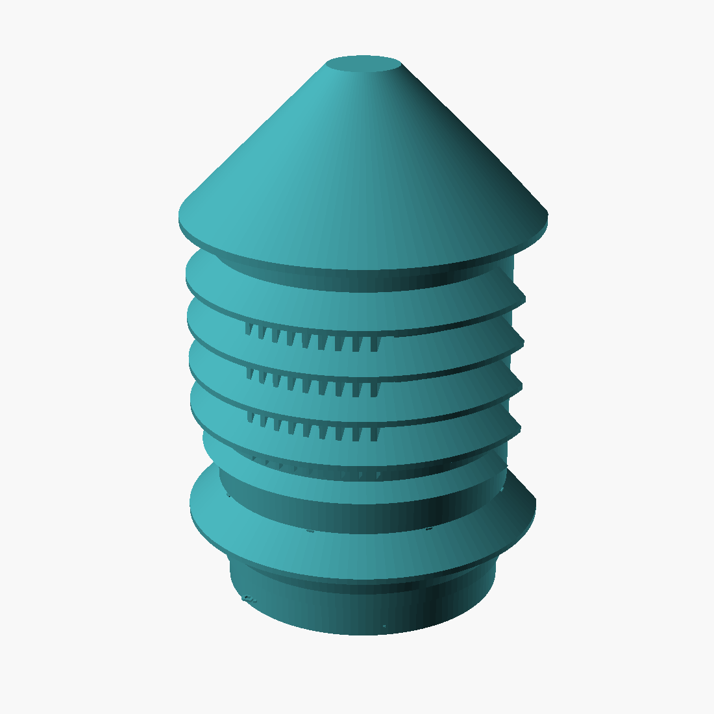

# DIY Node enclosure v4 — the column

One parametric OpenSCAD model ([`enclosure.scad`](enclosure.scad)) generates both variants — **Basic** (XIAO ESP32-S3 + BME680 on a 4×6 cm perfboard) and **Plus** (adds the Grove HM3301 PM module). STLs in [`stl/`](stl/), previews in [`img/`](img/), superseded designs in [`archive/`](archive/) — read that disclaimer before printing anything from there.

v3's answer to the 80×40 Grove module was a wide foot. v4 stands the module **vertical** instead: one slim Ø66 column, no foot, the can breathing forward through a louvered grille in the nose. The module is 80 mm long in whichever direction it lives — vertical trades footprint for height, and the column wears it better.

| | Basic | Plus |
|---|---|---|
| Body Ø | 66 mm | 66 mm |
| Brim Ø | 80 mm | 80 mm |
| Height | 100 mm | 120 mm |
| Printed parts | core + hood | core + hood |



## Where everything goes — printed into the parts

The core tells you. **`BME680 v  XIAO ^`** is debossed on the spine below the board rails: BME680 at the board's bottom edge (intake air), XIAO at the top (its heat leaves through the exhaust vent). **`PM SOCKET UP`** raised on the floor: the module slides into the front rails with the Grove-socket end up, can facing the grille. **`USB`** marks the cable arch on the cup's right side — drip loop outside. **`LIPO`** marks the battery position (below). The spine's back face carries the version stamp.

## The PM sensor, vertical, without compromising readings

The HM3301 datasheet allows the ports to face down **or sideways** — never up. Vertical mounting points them forward, and the rain problem is solved the same way the vents are: geometry. Four conical shade rings louver the grille (each ring's 45° shadow overlaps the next; the cone brim covers the top band), a 45° sill sheds the bottom lip, vertical bars keep geckos out, and the can's own metal face sits 3–4 mm behind it all — the datasheet's "inlet and outlet close to the product's aperture," satisfied sideways. Tape a patch of fine stainless mesh to the can face over the ports before mounting; the fan pulls its own sample through all of it. Burn-in and SCK co-location (parent README) remain the real calibration.

## LiPo, eyes open

Optional, zero height cost, sized for an **803040 (8×30×40, ~1000 mAh)** wired to the XIAO's BAT pads before the boards go in. **Basic:** the cell stands in a printed frame in the empty front bay, zip-tied. **Plus:** the column is full, so the cell rides foam-taped to the carrier's back face and drops in with the module — a floor lip stops it sliding. Honest note: a LiPo in a sealed-ish enclosure in Bali heat ages fast and swollen cells are not hypothetical. Use a quality cell with protection circuit, check it at mesh-cleaning time, and treat USB as the permanent supply — the battery is outage ride-through, not the power plan. `with_battery=false` deletes the provisions.

## Printing

White PETG, 0.2 mm layers, 4 perimeters, no supports, part cooling on.

| Part | Orientation | Notes |
|---|---|---|
| core | as exported — standing | 5 mm brim |
| hood | as exported — spire cap down | **10 mm brim**, first layer is only the Ø16 cap |

First print: pause the core at ~20 mm, test-fit a perfboard offcut in the rear grooves and the Grove carrier in the front grooves. `fit` (joint, 0.5) and `drop` are the knobs. `can_cx` shifts the grille if your module's can isn't where Seeed's Eagle files put it.

```sh
openscad -o stl/diy-node-plus-hood.stl -D 'variant="plus"' -D 'part="hood"' enclosure.scad
```

parts: `core` / `hood` / `plate` (both on one bed) / `assembly` · variants: `basic` / `plus` · flags: `with_battery`

## What else you need

| Qty | Item | Notes |
|---|---|---|
| 1 | fine stainless mesh patch ~40 × 40 mm | Plus: taped to the can face over the ports |
| 2 | M3 × 8 self-tapping screws | the joint |
| 4 | wall screws + plugs, pan head ≤ Ø8 | keyholes, ~4 mm standoff |
| 2–3 | zip ties | USB strain relief; Basic battery frame |
| opt | 803040 LiPo + foam tape | see above; JST or solder to BAT pads |

## Assembly

1. Hang the core on 4 pre-driven wall screws first — the keyholes sit behind the boards (top pair 30 mm apart at the upper marks).
2. Solder the module's four wires to its carrier test pads; battery (if any) to the XIAO BAT pads. Plus: foam-tape the cell to the carrier back.
3. Perfboard down the **rear** grooves — match the spine label: BME680 down, XIAO up, USB-C toward the right.
4. Plus: module down the **front** grooves, socket end up (floor label), can facing out. Mesh patch already on the can face.
5. USB cable out the floor arch, zip-tied at the post, drip loop outside.
6. Hood down over the spine until it seats on the cup shoulder; two M3 screws through the collar.

## Siting rules

Under eaves on a shaded wall, more than 20 cm off the ground, 1.5–2 m sweet spot, never over bare tin roofing. The grille faces away from the prevailing monsoon wind if the site allows it. Check the mesh patch and the floor weeps monthly.

## Known limits, honestly

Not IP65 — conformal coating (parent README) is what protects the electronics. A forward-facing grille, however louvered, sees more wind-driven rain than v3's downward windows; the trade was bulk for exposure, mitigated by four overlapping shade rings and the metal can face behind them. If a deployment site is brutally exposed, print v3 from the archive instead — its geometry is still sound, just bulky. No pole mount yet. SEN54 refresh gets its own revision when validated.

License: MIT, parent repo. Seeed board reference: [`ref_hm3301_board.pdf`](ref_hm3301_board.pdf) (CC-BY-SA). Fork it for Making Sense [your place] and tell us what changed.
